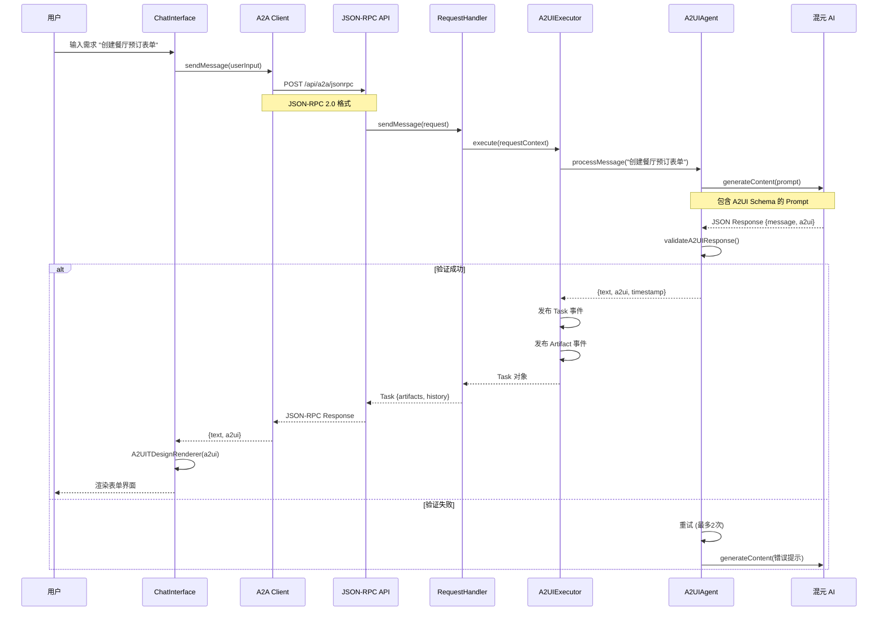

# A2UI Next.js 项目文档

## 📋 目录

1. [项目概述](#项目概述)
2. [技术栈](#技术栈)
3. [系统架构](#系统架构)
4. [核心流程](#核心流程)
5. [文件说明](#文件说明)
6. [API 接口](#api-接口)
7. [环境配置](#环境配置)

---

## 项目概述

**A2UI Next.js** 是一个基于 Agent-to-Agent (A2A) 协议的智能 UI 生成系统。用户通过自然语言描述需求，AI Agent 自动生成符合 TDesign 组件规范的交互式界面。

### 核心特性

- 🤖 **自然语言生成 UI**：用户用自然语言描述需求，AI 自动生成表单、卡片等组件
- 🔄 **A2A 协议集成**：使用官方 `@a2a-js/sdk` 实现标准化的 Agent 通信
- 🎨 **TDesign 组件渲染**：生成的 UI 基于腾讯 TDesign 组件库
- ✅ **JSON Schema 验证**：使用 AJV 验证生成的 A2UI 结构
- 🔁 **自动重试机制**：AI 生成失败时自动重试并修正错误

---

## 技术栈

### 前端框架
- **Next.js 14**: React 服务端渲染框架
- **React 18**: UI 组件库
- **TDesign React**: 腾讯企业级设计体系

### 后端与 AI
- **@a2a-js/sdk**: A2A 协议官方 SDK
- **Axios**: HTTP 客户端
- **混元 API**: 腾讯混元大模型（可配置）

### 工具库
- **uuid**: 生成唯一标识符
- **ajv**: JSON Schema 验证器

---

## 系统架构

```
┌─────────────────────────────────────────────────────────────┐
│                        浏览器客户端                          │
│                                                               │
│  ┌─────────────┐         ┌──────────────────────┐           │
│  │ ChatInterface│────────▶│ A2UITDesignRenderer │           │
│  │   (用户输入)  │         │   (UI 渲染器)        │           │
│  └──────┬──────┘         └──────────────────────┘           │
│         │                                                     │
│         │ sendMessage()                                      │
│         ▼                                                     │
│  ┌──────────────┐                                            │
│  │ A2A Client   │                                            │
│  │ (JSON-RPC)   │                                            │
│  └──────┬───────┘                                            │
└─────────┼─────────────────────────────────────────────────────┘
          │
          │ HTTP POST
          │ /api/a2a/jsonrpc
          ▼
┌─────────────────────────────────────────────────────────────┐
│                      Next.js 服务端                          │
│                                                               │
│  ┌──────────────────┐         ┌─────────────────────┐       │
│  │  JSON-RPC Route  │────────▶│ DefaultRequestHandler│       │
│  │  (API 入口)       │         │   (SDK 请求处理)     │       │
│  └──────────────────┘         └──────────┬──────────┘       │
│                                           │                   │
│                                           │ execute()         │
│                                           ▼                   │
│                                 ┌─────────────────┐           │
│                                 │  A2UIExecutor   │           │
│                                 │  (任务执行器)    │           │
│                                 └────────┬────────┘           │
│                                          │                    │
│                                          │ processMessage()   │
│                                          ▼                    │
│                                 ┌─────────────────┐           │
│                                 │   A2UIAgent     │           │
│                                 │  (AI 生成逻辑)   │           │
│                                 └────────┬────────┘           │
│                                          │                    │
│                                          │ generateContent()  │
│                                          ▼                    │
│                                 ┌─────────────────┐           │
│                                 │ Hunyuan Client  │           │
│                                 │  (AI 模型服务)   │           │
│                                 └─────────────────┘           │
└─────────────────────────────────────────────────────────────┘
```

---

## 核心流程

### 1. 用户请求流程



### 2. A2UI 生成与验证流程

```
┌───────────────────────────────────────────────────┐
│              A2UIAgent.processMessage()           │
└───────────────┬───────────────────────────────────┘
                │
                ▼
        ┌───────────────┐
        │ 构建 Prompt   │◄─── A2UI Schema
        │ (buildPrompt) │      组件规范
        └───────┬───────┘
                │
                ▼
        ┌───────────────┐
        │ 调用混元 AI    │
        │ generateContent│
        └───────┬───────┘
                │
                ▼
        ┌───────────────┐
        │ 解析 JSON     │
        │ parseResponse │
        └───────┬───────┘
                │
                ▼
        ┌───────────────┐
        │ JSON Schema   │◄─── AJV Validator
        │ 验证          │
        └───────┬───────┘
                │
        ┌───────┴────────┐
        │                │
        ▼                ▼
   ✅ 验证成功      ❌ 验证失败
        │                │
        │                ▼
        │         ┌──────────────┐
        │         │ 重试 (1-2次) │
        │         └──────┬───────┘
        │                │
        │                └──────┐
        ▼                       │
   返回 {text, a2ui} ◄──────────┘
```

### 3. SDK 事件发布流程

```
A2UIExecutor.execute()
        │
        ├─ 收到 A2UI 数据
        │
        ├─ 1. 发布 Task 事件
        │    {
        │      kind: 'task',
        │      id: taskId,
        │      status: { kind: 'in_progress' },
        │      artifacts: [],
        │      history: [
        │        { kind: 'message', role: 'agent', parts: [...] }
        │      ]
        │    }
        │
        ├─ 2. 发布 Artifact-Update 事件
        │    {
        │      kind: 'artifact-update',
        │      taskId: taskId,
        │      artifact: {
        │        artifactId: uuid(),
        │        name: 'a2ui-component.json',
        │        parts: [
        │          {
        │            kind: 'data',
        │            contentType: 'application/json',
        │            data: JSON.stringify({ message, a2ui })
        │          }
        │        ]
        │      }
        │    }
        │
        └─ 3. eventBus.finished()
                │
                ▼
         SDK 返回 Task 对象给客户端
```

---

## 文件说明

### 📁 `/src/app` - Next.js 应用入口

#### `page.js` - 主页面
- **功能**: 应用主界面，包含聊天交互组件
- **关键代码**:
  ```javascript
  export default function Home() {
    const [messages, setMessages] = useState([]);
    const [currentA2UI, setCurrentA2UI] = useState(null);
    
    return (
      <ChatInterface 
        onNewMessage={(msg, a2ui) => {
          setMessages([...messages, msg]);
          setCurrentA2UI(a2ui);
        }}
      />
    );
  }
  ```

#### `layout.js` - 全局布局
- **功能**: 定义页面布局和 TDesign 样式引入
- **关键**: 引入 `tdesign-react/es/style/index.css`

#### `globals.css` - 全局样式
- **功能**: 自定义 CSS 样式和主题变量

---

### 📁 `/src/app/api/a2a` - A2A 协议 API

#### `jsonrpc/route.js` - JSON-RPC 端点
- **功能**: A2A 协议的 JSON-RPC 2.0 API 入口
- **路由**: `POST /api/a2a/jsonrpc`
- **方法**:
  - `agent.sendMessage`: 发送消息并生成 UI
  - `agent.getTask`: 获取任务状态
  - `agent.cancelTask`: 取消任务

**核心代码**:
```javascript
const requestHandler = new DefaultRequestHandler(
  agentCard,
  taskStore,
  agentExecutor
);

async function handleSendMessageWithSDK(rpcRequest) {
  const result = await requestHandler.sendMessage({
    message,
    contextId,
    taskId,
    user: params.user,
    configuration: params.configuration
  });
  
  return NextResponse.json({
    jsonrpc: '2.0',
    result,  // Task 或 Message 对象
    id
  });
}
```

#### `agent-card/route.js` - Agent 身份卡片
- **功能**: 返回 Agent 的元数据和能力描述
- **路由**: `GET /api/a2a/agent-card`
- **返回**: Agent 名称、版本、能力等信息

---

### 📁 `/src/components` - React 组件

#### `ChatInterface.jsx` - 聊天交互界面
- **功能**: 用户输入框、消息列表、A2UI 渲染容器
- **状态管理**:
  ```javascript
  const [messages, setMessages] = useState([]);
  const [input, setInput] = useState('');
  const [loading, setLoading] = useState(false);
  ```

**关键流程**:
```javascript
const handleSend = async () => {
  const result = await a2aClient.sendMessage(input);
  
  const aiMessage = {
    role: 'assistant',
    text: result.text,
    timestamp: result.timestamp
  };
  
  onNewMessage(aiMessage, result.a2ui);
};
```

#### `A2UITDesignRenderer.jsx` - TDesign 组件渲染器
- **功能**: 将 A2UI JSON 转换为 TDesign React 组件
- **支持组件**:
  - **表单**: form, textInput, textArea, select, datePicker, checkbox, radio
  - **布局**: container, card
  - **交互**: button, divider
  - **展示**: text, title, image

**渲染逻辑**:
```javascript
const renderComponent = (component) => {
  switch (component.type) {
    case 'textInput':
      return <Input {...component.props} />;
    case 'select':
      return <Select options={formatOptions(component.props.options)} />;
    case 'form':
      return <Form>{renderChildren(component.children)}</Form>;
    // ... 更多组件
  }
};
```

---

### 📁 `/src/lib` - 核心业务逻辑

#### `a2a-client.js` - A2A 客户端
- **功能**: 封装 JSON-RPC 调用，与服务端通信
- **关键方法**:
  ```javascript
  async sendMessage(userInput) {
    const response = await axios.post('/api/a2a/jsonrpc', {
      jsonrpc: '2.0',
      method: 'agent.sendMessage',
      params: {
        message: {
          kind: 'message',
          messageId: uuidv4(),
          role: 'user',
          parts: [{ kind: 'text', text: userInput }]
        },
        contextId: this.contextId,
        taskId: uuidv4()
      },
      id: uuidv4()
    });
    
    return this.parseResponse(response.data.result);
  }
  ```

**响应解析**:
- 支持 `Task` 对象（包含 artifacts）
- 支持 `Message` 对象（纯文本）
- 从 `artifacts` 中提取 A2UI JSON

#### `a2a-executor.js` - 任务执行器
- **功能**: 实现 SDK 的 `AgentExecutor` 接口
- **核心方法**: `execute(requestContext, eventBus)`
- **事件发布**:
  ```javascript
  // 1. 发布 Task 事件
  eventBus.publish({
    kind: 'task',
    id: taskId,
    history: [agentMessage],
    artifacts: []
  });
  
  // 2. 发布 Artifact
  eventBus.publish({
    kind: 'artifact-update',
    taskId,
    artifact: { artifactId, name, parts }
  });
  
  // 3. 完成
  eventBus.finished();
  ```

#### `agent.js` - A2UI Agent 核心
- **功能**: AI 生成 A2UI 的主逻辑
- **流程**:
  1. 构建 Prompt（包含 A2UI Schema）
  2. 调用混元 AI 生成 JSON
  3. 解析并验证响应
  4. 失败时自动重试（最多2次）

**重试机制**:
```javascript
while (attempt <= this.maxRetries) {
  try {
    const result = await this.model.generateContent(prompt);
    const parsed = this.parseAIResponse(result.response.text());
    const validation = validateA2UIResponse(parsed);
    
    if (validation.valid) {
      return { text: parsed.message, a2ui: parsed.a2ui };
    } else {
      currentQuery = `验证失败: ${formatValidationErrors(validation.errors)}`;
    }
  } catch (error) {
    if (attempt <= maxRetries) continue;
    throw error;
  }
}
```

#### `a2ui-spec.js` - A2UI 规范定义
- **功能**: 定义 A2UI 组件结构和 JSON Schema
- **Prompt 构建**: 将规范嵌入 AI Prompt，指导生成

#### `a2ui-validator.js` - JSON Schema 验证器
- **功能**: 使用 AJV 验证生成的 A2UI JSON
- **验证规则**:
  - 必须包含 `components` 数组
  - 每个组件必须有 `id`, `type`, `props`
  - `props` 必须符合组件类型规范

```javascript
const schema = {
  type: 'object',
  required: ['components'],
  properties: {
    components: {
      type: 'array',
      items: {
        type: 'object',
        required: ['id', 'type', 'props']
      }
    }
  }
};
```

#### `a2a-agent-card.js` - Agent 配置卡片
- **功能**: 定义 Agent 的身份信息
- **内容**: 名称、版本、能力、配置参数

#### `hunyuan-service.js` - 混元 AI 客户端
- **功能**: 封装混元 API 调用
- **配置**: 支持自定义 baseURL、模型、temperature 等参数

---

## API 接口

### 1. `POST /api/a2a/jsonrpc`

**功能**: JSON-RPC 2.0 端点，处理 A2A 协议请求

**请求示例**:
```json
{
  "jsonrpc": "2.0",
  "method": "agent.sendMessage",
  "params": {
    "message": {
      "kind": "message",
      "messageId": "uuid-1234",
      "role": "user",
      "parts": [
        {
          "kind": "text",
          "text": "创建一个用户注册表单"
        }
      ]
    },
    "contextId": "context-uuid",
    "taskId": "task-uuid"
  },
  "id": "request-uuid"
}
```

**响应示例（Task 对象）**:
```json
{
  "jsonrpc": "2.0",
  "result": {
    "kind": "task",
    "id": "task-uuid",
    "contextId": "context-uuid",
    "status": { "kind": "in_progress" },
    "artifacts": [
      {
        "artifactId": "artifact-uuid",
        "name": "a2ui-component.json",
        "parts": [
          {
            "kind": "data",
            "contentType": "application/json",
            "data": "{\"message\":\"...\",\"a2ui\":{...}}"
          }
        ]
      }
    ],
    "history": [
      {
        "kind": "message",
        "messageId": "msg-uuid",
        "role": "agent",
        "parts": [
          { "kind": "text", "text": "好的，我为您创建了注册表单" }
        ]
      }
    ]
  },
  "id": "request-uuid"
}
```

### 2. `GET /api/a2a/agent-card`

**功能**: 获取 Agent 元数据

**响应示例**:
```json
{
  "name": "A2UI Assistant",
  "version": "1.0.0",
  "description": "智能 UI 生成助手，基于自然语言生成 TDesign 组件界面",
  "capabilities": {
    "a2ui": true,
    "streaming": false,
    "context": true
  }
}
```

---

## 环境配置

### `.env.local` 示例

```bash
# 混元 API 配置
HUNYUAN_API_KEY=your_api_key_here
HUNYUAN_BASE_URL=http://hunyuanapi.woa.com/openapi/v1

# AI 模型配置
AI_MODEL=hunyuan-turbo
AI_TEMPERATURE=0.3
AI_MAX_TOKENS=2048
AI_TOP_P=0.95

# Next.js 配置
NEXT_PUBLIC_API_BASE_URL=http://localhost:3000
```

### 关键参数说明

| 参数 | 说明 | 默认值 |
|------|------|--------|
| `HUNYUAN_API_KEY` | 混元 API 密钥 | *必填* |
| `HUNYUAN_BASE_URL` | 混元 API 地址 | `http://hunyuanapi.woa.com/openapi/v1` |
| `AI_MODEL` | 使用的模型名称 | `hunyuan-turbo` |
| `AI_TEMPERATURE` | 生成温度（0-1） | `0.3` |
| `AI_MAX_TOKENS` | 最大 token 数 | `2048` |
| `AI_TOP_P` | Top-P 采样参数 | `0.95` |

---

## 运行项目

### 1. 安装依赖
```bash
npm install
```

### 2. 配置环境变量
```bash
cp .env.example .env.local
# 编辑 .env.local 填入 API Key
```

### 3. 启动开发服务器
```bash
npm run dev
```

访问 http://localhost:3000

### 4. 构建生产版本
```bash
npm run build
npm start
```

---

## 项目亮点

1. ✅ **完整的 A2A 协议实现**: 使用官方 SDK，符合标准规范
2. ✅ **智能错误处理**: AI 生成失败时自动重试并修正
3. ✅ **类型安全**: JSON Schema 验证确保数据结构正确
4. ✅ **组件化设计**: 前后端分离，易于扩展
5. ✅ **生产就绪**: 支持服务端渲染、错误处理、日志记录

---

## 常见问题

### Q1: 为什么 A2UI 没有渲染？
**A**: 检查以下几点：
1. 浏览器控制台查看是否有 `🎨 Extracted A2UI` 日志
2. 确认服务端返回的是 `Task` 对象而不是 `Message`
3. 检查 `artifacts` 数组是否包含 JSON 数据

### Q2: 如何添加新的组件类型？
**A**: 
1. 在 `a2ui-spec.js` 中定义新组件的规范
2. 在 `A2UITDesignRenderer.jsx` 中添加对应的渲染逻辑
3. 更新 `a2ui-validator.js` 的 Schema

### Q3: 如何切换 AI 模型？
**A**: 修改 `.env.local` 中的 `AI_MODEL` 变量

---

**文档版本**: 1.0.0  
**最后更新**: 2025-12-19
