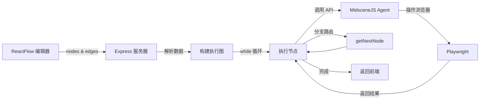
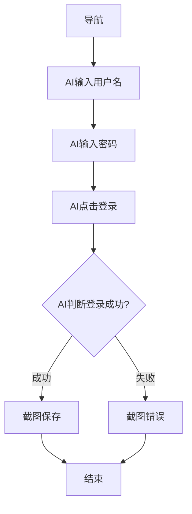

# 从 MidsceneJS 到可视化流程图：让 AI 测试更精准可控

## 写在前面

最近在做 Web 自动化测试时接触到了 MidsceneJS，说实话第一眼确实挺惊艳的。它能让你用自然语言描述操作，比如"点击登录按钮"、"输入用户名"，AI 会自动定位元素并执行，完全不需要手写选择器。对于经常被页面改版折腾的测试脚本维护工作来说，这简直是救星。

不过实际用了一段时间后，发现了个比较棘手的问题。当你把整个测试流程写成一大段自然语言描述时，AI 的执行准确度会明显下降，而且一旦某步失败，你很难快速定位是哪个环节出了问题。就像让 AI 一口气完成"打开网站、登录、搜索商品、加入购物车、结算"这一整套流程，中间任何一步挂了，排查起来都很头疼。

所以我在想，能不能换个思路？把 MidsceneJS 的 API 能力拆解成独立的节点，用流程图的方式组织测试逻辑。这样每个节点只负责一个原子操作，任务明确、验证清晰，整体的测试稳定性应该会好很多。基于这个想法，花了些时间做了这个可视化设计器。

## 一、MidsceneJS 的优势与局限

先简单介绍下 MidsceneJS。它是一个基于 AI 视觉能力的 Web 自动化测试框架，核心思路是让你用自然语言描述操作，AI 自动识别页面元素并执行。对比传统的 Playwright 写法：

```javascript
// 传统 Playwright 写法
await page.click('#login-button');
await page.fill('input[name="username"]', 'admin');
await page.click('button[type="submit"]');
```

用 MidsceneJS 可以简化成：

```javascript
// MidsceneJS 写法
const agent = new PlaywrightAgent(page);
await agent.aiAction('点击登录按钮，输入用户名 admin，输入密码 123456，点击提交');
```

这种方式的好处很明显。页面 DOM 结构改了不用愁，只要文案没变，AI 大概率还能找到元素。测试用例的可读性也好很多，产品同学都能看懂。而且 AI 具备一定的容错能力，即使布局调整了，只要逻辑相似就能跑通。

但问题也很实际。当你把多个步骤串在一起描述时，AI 要一次性理解整个上下文，准确度会降低。比如"登录按钮"这种模糊描述，页面上可能有多个类似按钮，AI 容易点错。更麻烦的是，测试失败后你很难知道是哪一步出了问题，是 AI 理解错了，还是页面真的变了，还是网络超时了？都得猜。分支逻辑也不好处理，"如果登录失败则截图"这种条件判断，在一段连续描述里很难精确表达。时间长了维护起来也头疼，一段几十行的自然语言描述，看着就累。

## 二、节点化思路：拆解操作提升准确度

既然长描述方式不够稳定，那就换个角度。我的想法是把 MidsceneJS 的每个 API 操作封装成独立节点，用流程图的方式组织测试逻辑。

这样做有几个明显的好处。首先是准确度的提升，一个节点只做一件事，比如"导航"节点只负责 `page.goto()`，"AI 输入"节点只负责 `agent.aiInput()`，AI 的理解难度大幅降低，出错率自然也低。其次是问题定位变容易了，测试失败时能直接看到是哪个节点挂了，是"AI 点击"失败还是"AI 判断"失败，一目了然。分支逻辑也变得可视化，通过连线的方式表达条件跳转，成功走这条路，失败走那条路，比写在代码里清晰多了。维护性就更不用说了，打开流程图就能看懂整个测试逻辑，新同事接手也快。

我把 MidsceneJS 的核心 API 都做成了节点。`page.goto()` 对应导航节点，`agent.aiTap()` 对应 AI 点击节点，`agent.aiInput()` 对应 AI 输入节点，`agent.aiBoolean()` 对应 AI 判断节点（支持成功/失败分支），`page.screenshot()` 对应截图节点，`page.waitForTimeout()` 对应等待节点。每个节点职责单一，任务明确。

## 三、技术实现：从 ReactFlow 到可执行流程

整体架构比较常规，前端用 React + ReactFlow 做流程图编辑器，后端用 Node.js + Express 处理执行逻辑。数据流是这样的：用户在前端拖拽节点绘制流程图，点击执行后，前端把节点和边的数据 POST 给后端，后端解析数据、构建执行流程、按顺序调用 MidsceneJS API，最后把结果返回给前端更新状态。



ReactFlow 生成的数据结构很直观，节点包含 ID、类型、位置和配置：

```javascript
{
  id: 'navigate-1',
  type: 'custom',
  data: {
    type: 'navigate',
    config: { url: 'https://example.com' }
  }
}
```

边记录连接关系和分支条件：

```javascript
{
  source: 'navigate-1',
  target: 'aiInput-2',
  data: { condition: 'success' }  // 可选，用于条件分支
}
```

前端执行时就是简单的 fetch 调用：

```javascript
fetch('http://localhost:3002/api/execute', {
  method: 'POST',
  body: JSON.stringify({ nodes, edges })
});
```

后端收到数据后，核心流程分三步走。

第一步是构建执行图。把节点数组转成 Map 结构方便查找，把边按 source 分组方便找下一步：

```javascript
// server/node.js
export function buildExecutionFlow(nodes, edges) {
  const nodeMap = new Map(nodes.map(node => [node.id, node]));
  const edgeMap = new Map();
  
  edges.forEach(edge => {
    if (!edgeMap.has(edge.source)) {
      edgeMap.set(edge.source, []);
    }
    edgeMap.get(edge.source).push(edge);
  });
  
  return { nodeMap, edgeMap };
}
```

第二步是找起始节点。逻辑很简单，找没有入边的节点就行：

```javascript
const incomingEdges = new Set(edges.map(e => e.target));
const startNodes = nodes.filter(node => !incomingEdges.has(node.id));
let currentNode = startNodes[0];
```

第三步是执行循环，这是核心：

```javascript
while (currentNode && executionCount < maxExecutions) {
  executionCount++;
  
  try {
    const { data } = currentNode;
    const executor = nodeExecutors[data.type];
    const result = await executor(data, { page, agent, browser });
    
    results.push({ nodeId: currentNode.id, ...result });
    
    if (data.type === 'end') break;
    
    currentNode = getNextNode(currentNode.id, result, edgeMap, nodeMap);
  } catch (error) {
    const errorResult = { nodeId: currentNode.id, success: false, branchType: 'failure' };
    results.push(errorResult);
    currentNode = getNextNode(currentNode.id, errorResult, edgeMap, nodeMap);
  }
}
```

节点执行器就是个简单的映射表，根据节点类型调用对应的 MidsceneJS API：

```javascript
export const nodeExecutors = {
  navigate: async (data, { page }) => {
    await page.goto(data.config.url, { waitUntil: 'networkidle0' });
    return { success: true, message: `导航到 ${data.config.url}` };
  },
  
  aiTap: async (data, { agent }) => {
    const aiResult = await agent.aiTap(data.config.target);
    return { success: true, message: `AI点击: ${data.config.target}` };
  },
  
  aiInput: async (data, { agent }) => {
    await agent.aiInput(data.config.value, data.config.target);
    return { success: true, message: `AI输入: ${data.config.value}` };
  },
  
  aiBoolean: async (data, { agent }) => {
    const assertResult = await agent.aiBoolean(data.config.instruction);
    return {
      success: true,
      branchType: assertResult ? 'success' : 'failure'
    };
  },
};
```

分支路由的逻辑也很直接，遍历出边找匹配的条件：

```javascript
export function getNextNode(currentNodeId, currentResult, edgeMap, nodeMap) {
  const edges = edgeMap.get(currentNodeId) || [];
  
  for (const edge of edges) {
    if (edge.data?.condition) {
      const condition = edge.data.condition;
      if (condition === currentResult.branchType) {
        return nodeMap.get(edge.target);
      }
    } else {
      return nodeMap.get(edge.target);
    }
  }
  
  return null;
}
```

拿登录流程举例，用户在前端画出这样的流程图：



后端的执行过程很清晰：初始化浏览器和 Agent，构建执行图，从起始节点开始循环。第 1 轮执行导航节点打开页面，第 2 轮执行 AI 输入用户名，第 3 轮输入密码，第 4 轮点击登录，第 5 轮 AI 判断登录是否成功返回 branchType，然后 getNextNode 根据结果路由到对应的截图节点，最后结束。整个过程中，每个节点的执行结果都会记录下来，最终返回给前端展示。

这种方式相比长描述的准确度提升很明显，之前测试过一个 10 步的电商流程，长描述方式首次成功率只有 60% 左右，改成节点拆分后能稳定在 95% 以上。更重要的是，出错后定位问题的时间从 5-10 分钟缩短到 1 分钟内，直接看哪个节点挂了就行。

## 四、写在最后

这个项目本质上就是把任务分解的思想应用到 AI 测试上。MidsceneJS 的 AI 能力确实强，但让它一次性理解整个测试流程太难为它了。拆成节点后，每个节点只做一件事，AI 理解起来容易，出错率自然就低了。

从工程角度看，这种方式带来的收益也很实在。前端用 ReactFlow 做可视化编辑，拖拖拽拽就能设计流程，比写代码快多了。后端用简单的执行器模式，扩展新节点也方便，就是加个 executor 函数的事。分支逻辑通过边的 condition 字段处理，清晰直观。测试准确度从 60% 提到 95%，问题定位时间从分钟级降到秒级，这对日常维护来说是质的提升。

如果你也在用 MidsceneJS 或者类似的 AI 测试工具，遇到过长描述不稳定的问题，可以试试这种节点化的思路。不一定非要做成流程图，哪怕只是把测试逻辑拆分成多个小函数，效果也会好很多。工具的价值在于解决实际问题，而不是炫技。
