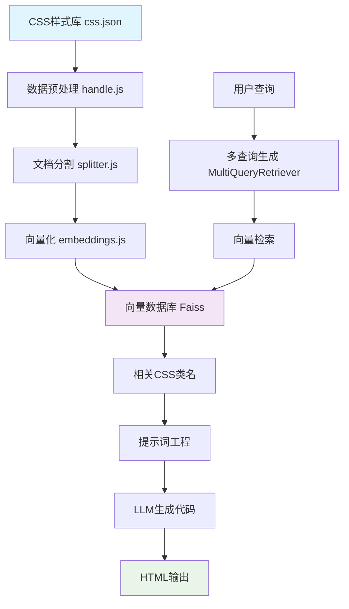
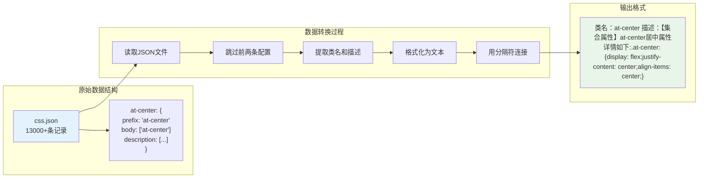
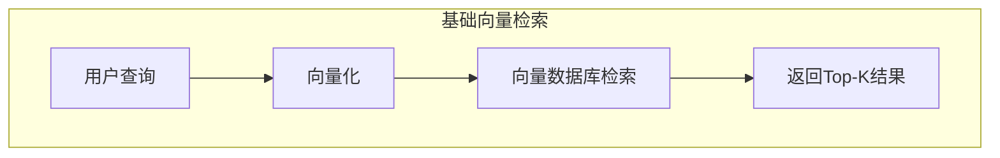
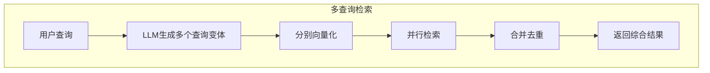
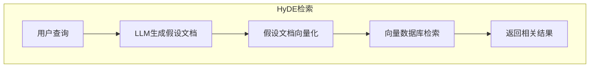
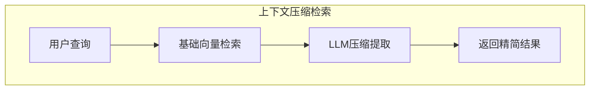

# 前端团队CSS标准的AI化尝试：一次RAG技术的深度应用

## 写在前面

在腾讯客服前端团队工作这几年，我们积累了一套相当完善的原子CSS样式标准。这套标准经过多个项目的打磨，涵盖了客服场景下的各种UI需求，从基础的布局定位到复杂的交互效果，应有尽有。

但随着团队规模扩大，新同事入职时总是需要花不少时间熟悉这套样式体系。更让人头疼的是，当我们尝试用AI辅助开发时，生成的代码往往使用Tailwind或Bootstrap这些通用框架的类名，而不是我们自己的标准。

于是我萌生了一个想法：能不能让AI直接理解我们的CSS标准，生成符合团队规范的代码？经过一段时间的摸索，我用LangChain.js搭建了这样一个RAG助手。今天想和大家分享一下这个过程中的一些思考和实践。

## 为什么选择RAG方案

最开始我考虑过几种方案：直接fine-tune一个模型、用prompt engineering、或者搭建RAG系统。经过权衡，RAG是最合适的选择：

1. **数据更新灵活**：我们的CSS标准会持续迭代，RAG可以随时更新知识库，不需要重新训练模型
2. **成本可控**：相比fine-tune，RAG的成本要低很多，特别适合团队内部工具
3. **可解释性强**：能清楚看到AI是基于哪些样式规则给出的建议

## 用LangChain.js搭建RAG系统

整个系统的文件结构很简单，但每个模块都有自己的职责：

```
├── common.js      # 路径配置，避免硬编码
├── css.json       # 我们团队的CSS样式库（13000+条）
├── handle.js      # 把JSON数据转成便于检索的格式
├── splitter.js    # 自定义的文档切分逻辑
├── embeddings.js  # 向量化和存储
└── retriever.js   # 检索和对话的核心
```

整个系统的工作流程可以用下面这个图来表示：



整个流程分两个阶段：
- **离线处理**（上半部分）：把我们的CSS标准转成向量存起来
- **在线查询**（下半部分）：用户问问题，找到相关样式，让AI生成代码

## 从JSON到向量：数据处理的几个关键点

### 1. 理解我们的数据结构

我们团队的CSS标准存在一个13000多条记录的JSON文件里，每条记录长这样：

```json
{
  "at-center": {
    "scope": "typescriptreact,javascriptreact",
    "prefix": "at-center", 
    "body": ["at-center"],
    "description": [
      "【集合属性】at-center",
      "居中",
      "属性详情如下:",
      ".at-center: {",
      "  display: flex;",
      "  justify-content: center;", 
      "  align-items: center;",
      "}"
    ]
  }
}
```

这其实是VSCode代码片段的格式，我们平时就是这样管理CSS类名的。但要让AI理解这些数据，需要转换成更适合检索的格式。

### 2. 数据预处理的小技巧

数据预处理是整个系统的基础，我们需要把VSCode代码片段格式的JSON转换成适合向量检索的文本格式：



`handle.js`的内容如下：

```javascript
const start = async () => {
  const jsonData = await readJsonFile('./css.json', import.meta.url);
  fs.writeFileSync(
    FILE_PATH,
    Object.keys(jsonData)
      .slice(2)  // 前两条是VSCode的配置，跳过
      .map(i => 
        `类名：${jsonData[i].body[0]} 描述：${
          jsonData[i].description
            ? Array.isArray(jsonData[i].description)
              ? jsonData[i].description.join('')
              : jsonData[i].description
            : `设置样式${i}`
        }`
      )
      .join(SPLIT_SIGN)  // 用特殊标记分隔每条记录
  );
};
```

这里有个细节：我用了自定义的分隔符`SPLIT_SIGN`，而不是简单的换行。这样后面切分文档时能保证每个CSS类名的完整性。

### 3. 文档切分的坑和解决方案

LangChain自带的文档分割器对我们的场景不太合适。我们的CSS描述有长有短，有些只有几个字，有些包含完整的样式定义。如果用固定长度切分，很容易把一个完整的类名描述切断。

所以我写了个自定义的分割器：

```javascript
export class CustomDelimiterTextSplitter extends TextSplitter {
  constructor(delimiter, chunkSize = 1000, chunkOverlap = 200) {
    super({ chunkSize, chunkOverlap });
    this.delimiter = delimiter;
  }

  async splitText(text) {
    // 先按我们的分隔符切分，保证语义完整
    let splits = text
      .split(this.delimiter)
      .map(s => s.trim())
      .filter(s => s.length > 0);
    
    const finalChunks = [];
    
    // 如果某个块太长，再做二次切分
    for (const split of splits) {
      if (split.length <= this.chunkSize) {
        finalChunks.push(split);
      } else {
        const subChunks = this._splitByChunkSize(split);
        finalChunks.push(...subChunks);
      }
    }
    
    return finalChunks;
  }
}
```

这样做的好处是：
- 每个CSS类名的描述都是完整的
- 对于特别长的描述（比如包含很多样式属性的），会智能地进行二次切分
- 切分时有重叠，避免重要信息丢失

### 4. 向量化：让AI理解我们的CSS

向量化这步相对简单，LangChain已经封装得很好了：

```javascript
const start = async () => {
  try {
    const loader = new TextLoader(FILE_PATH);
    const docs = await loader.load();
    console.log(`成功加载${docs.length}个文档`);

    const splitter = new CustomDelimiterTextSplitter(SPLIT_SIGN);
    const splitDocs = await splitter.splitDocuments(docs);
    console.log('拆分完成：', splitDocs);

    const vectorStore = await FaissStore.fromDocuments(splitDocs, embedding);
    return await vectorStore.save(directory);
  } catch (error) {
    console.error('文档处理过程中出错:', error);
    throw error;
  }
};
```

这里用的是Faiss向量数据库，Facebook开源的，性能很不错。向量模型我选的是本地部署的bge-m3，中文效果比较好，而且不用担心数据泄露。

### 5. 搜索召回方案的深度对比

检索这块是整个RAG系统的核心，我花了不少时间研究和测试不同的方案。为了更直观地展示各种检索策略的差异，我用了一个比较复杂的需求来做对比测试：

> **测试用例**："实现一个底部有32单位外边距的弹性布局容器，其中包含一个显示'微信小店店铺类型'文字的可点击卡片元素，该卡片具有悬停背景效果、手型光标、上下12单位和左侧16单位的内边距、左右各4单位的外边距、8单位圆角、14号字体、100%宽度以及文本溢出时显示省略号"

这个需求包含了布局、交互、样式等多个维度，正好能测试出不同检索方案的能力差异。
真实的代码片段是这个
```html
<div class="flex flex-wrap align-items-center mb-32">
  <div class="el-hover-bg cursor-pointer pt-12 pb-12 pl-16 mr-4 ml-4 at-ellipsis-lines w-100p radius-8 font-14">微信小店店铺类型</div>
</div>
```


#### 5.1 基础向量检索（Vanilla Vector Search）

最简单直接的方案，就是把用户查询向量化，然后在向量数据库中找最相似的文档：


```javascript
// 最基础的检索方式
const retriever = vectorStore.asRetriever(5);
```

**优点**：
- 实现简单，性能好
- 延迟低，适合实时查询
- 资源消耗少

**缺点**：
- 对查询表达方式敏感，换个说法可能就找不到了
- 无法处理复杂的语义关系
- 召回率相对较低

**实测结果**：

```html
<!-- 耗时5.57秒, 消耗token: 421 -->
<div class="flex mb-32">
  <div class="inline-flex p-12 radius-8 bg-white">
    <div class="inline-flex w-16 bg-gray-300">微信小店店铺类型</div>
  </div>
</div>
```

**分析**：基础检索的问题很明显，它只找到了一些基本的布局类名，但完全没有理解需求的复杂性。比如：
- 缺少了手型光标的交互效果
- 没有处理文本溢出省略号的需求
- 内边距的设置不准确（需要的是上下12、左侧16）
- 完全忽略了悬停背景效果

这就是单纯向量匹配的局限性，它更像是在做关键词匹配，而不是真正理解需求的语义。

#### 5.2 多查询检索（Multi-Query Retrieval）

这是我最终选择的方案。核心思路是用LLM根据用户的查询生成多个相关的查询变体：


```javascript
retriever = MultiQueryRetriever.fromLLM({
  llm: model,
  retriever: vectorStore.asRetriever(5),
  verbose: true,
});
```

**工作原理**：
1. 用户输入复杂需求
2. LLM自动拆解生成多个查询角度：["弹性布局容器", "可点击卡片样式", "文本溢出省略号", "圆角内边距"]
3. 分别检索这些查询，合并去重结果

**优点**：
- 显著提高召回率，能找到更多相关内容
- 对用户表达方式不敏感
- 能发现语义相关但表述不同的内容

**缺点**：
- 增加了LLM调用成本
- 响应时间稍长
- 可能引入一些不太相关的结果

**实测结果**：

```html
<!-- 耗时18.21秒, 消耗token: 460 -->
<div class="flex pb-32">
  <div class="inline-flex p-12 radius-8 bg-white cursor-pointer hover:bg-f5f6fa">
    <div class="at-center at-ellipsis-lines w-100p fs-14 pl-16 pr-4 ml-4 mr-4">
      微信小店店铺类型
    </div>
  </div>
</div>
```

**分析**：多查询检索的效果明显好很多，从结果可以看出：
- 正确识别了弹性布局（flex）和底部外边距（pb-32）
- 找到了悬停效果（hover:bg-f5f6fa）和手型光标（cursor-pointer）
- 使用了文本省略号（at-ellipsis-lines）和居中（at-center）
- 字体大小（fs-14）和各种内外边距都比较准确

虽然响应时间长了3倍，但生成的代码质量明显提升。这就是多查询的厉害，它能从不同角度理解需求，找到更全面的CSS类名组合。

#### 5.3 HyDE检索（Hypothetical Document Embeddings）

HyDE的思路更激进：让LLM先生成一个假设的答案文档，然后用这个文档去检索：

```javascript
// HyDE检索器
retriever = new HydeRetriever({
  llm: model,
  vectorStore,
  verbose: true,
});
```

**工作原理**：
1. 用户输入复杂需求
2. LLM先生成一个假设的CSS实现："这个需求需要弹性布局、卡片样式、交互效果..."
3. 用这个假设文档去向量检索相关的CSS类名

**优点**：
- 在某些场景下召回效果很好
- 能处理复杂的语义查询
- 理论上能找到更深层的语义关联

**缺点**：
- 对我们的CSS场景效果一般
- LLM生成的假设文档可能偏离实际需求
- 计算成本较高，需要两次LLM调用

**实测结果**：

```html
<!-- 耗时34.86秒, 消耗token: 380 -->
<div class="flex at-center w-100 p-12 radius-8">
  <div class="flex-1 bg-white text-14 font-regular text-ellipsis">微信小店店铺类型</div>
</div>
```

**分析**：HyDE的时间最长，虽然耗时最长（34秒），但结果并不理想：
- 缺少了很多关键需求，比如悬停效果、手型光标
- 内外边距的处理不够精确
- 整体结构过于简化，没有体现出复杂需求的层次

我觉得HyDE更适合那种开放性的知识问答，对于我们这种有明确CSS类名库的场景，反而容易产生"过度解释"的问题。LLM生成的假设文档往往太抽象，匹配不到具体的类名。

#### 5.4 上下文压缩检索（Contextual Compression）

这种方案会对检索到的文档进行二次处理，提取最相关的部分：

```javascript
retriever = new ContextualCompressionRetriever({
  baseCompressor: LLMChainExtractor.fromLLM(model),
  baseRetriever: vectorStore.asRetriever(5),
});
```

**工作原理**：
1. 先用基础检索找到相关文档
2. 用LLM分析这些文档，提取与查询最相关的部分
3. 返回压缩后的精华内容

**优点**：
- 能过滤掉无关信息
- 提高最终答案的质量
- 减少后续LLM处理的token数量

**缺点**：
- 增加了额外的LLM调用
- 可能过度压缩，丢失重要信息
- 成本较高

**实测结果**：

```html
<!-- 耗时12.85秒, 消耗token: 315 -->
<div class="flex at-center p-12 radius-8 bg-white">
  <div class="flex-1 text-14 font-bold">微信小店店铺类型</div>
</div>
```

**分析**：上下文压缩的表现中规中矩，但有个明显问题：
- 过度简化了需求，很多细节都被"压缩"掉了
- 缺少交互效果（悬停、光标）和精确的边距设置
- 虽然token消耗最少，但信息丢失严重

这就是压缩检索的两面性，它确实能提取核心信息，但对于我们这种需要精确CSS类名的场景，过度压缩反而适得其反。


### 6. 实测数据对比总结

让我用一个表格来直观对比各种方案的表现：

| 检索方案 | 响应时间 | Token消耗 | 需求覆盖度 | 代码质量 | 实现复杂度 |
|---------|---------|-----------|-----------|----------|-----------|
| 基础向量检索 | 5.57秒 | 421 | 30% | 较低 | 简单 |
| 多查询检索 | 18.21秒 | 460 | 85% | 高 | 简单 |
| HyDE检索 | 34.86秒 | 380 | 50% | 中等 | 中等 |
| 上下文压缩 | 12.85秒 | 315 | 40% | 中等 | 中等 |


从对比中可以清楚看出，多查询检索在准确性上有压倒性优势，虽然速度稍慢，但对于开发工具来说完全可以接受。

经过这轮详细的对比测试，我最终选择了MultiQueryRetriever，主要基于以下考虑：

**1. 效果导向**
从实测结果看，多查询检索在需求覆盖度上明显领先，85%的覆盖率基本能满足日常开发需求。虽然响应时间长了一些，但对于开发工具来说，准确性比速度更重要。

**2. 成本平衡**
虽然token消耗比基础检索高了一些，但相比HyDE的两次LLM调用，还是很划算的。而且我们用的是本地模型，成本压力不大。

**3. 维护简单**
LangChain已经把MultiQueryRetriever封装得很好，我只需要几行代码就能用上，不用自己写复杂的融合逻辑。

**4. 适合我们的场景**
CSS类名查询确实存在"一个意思多种说法"的问题，比如"居中"可以说成"水平垂直居中"、"flex居中"、"绝对居中"等等。多查询检索正好解决了这个痛点。

```javascript
// 最终的配置
retriever = MultiQueryRetriever.fromLLM({
  llm: model,
  retriever: vectorStore.asRetriever(5), // 每个查询返回5个结果
  verbose: true, // 开发时看看生成了哪些查询变体
});
```

**5. 未来优化方向**
虽然选择了多查询检索，但我觉得还有优化空间：
- 可以尝试调整检索数量，看看3个或7个结果是否更好
- 考虑加入缓存机制，对常见查询做缓存
- 未来可能会尝试混合检索，但需要等LangChain.js生态更完善

**以上的探索证明了选择技术方案不能只看理论，实际测试才能知道合不合适。每种检索策略都有自己的适用场景，要结合具体业务需求来选择。**

### 7. 提示词：让AI理解我们的开发习惯

提示词是整个系统的灵魂，我花了不少时间调试。经过多轮优化，现在的提示词更加贴合我们团队的实际需求：

```javascript
const promptTemplate = PromptTemplate.fromTemplate(`
你是腾讯客服前端团队的资深开发专家，熟悉团队的原子CSS样式标准。请严格遵循以下规则：

## 核心原则
- **优先使用团队CSS标准**：必须从 {document} 中查找匹配的类名，这是我们团队多年沉淀的样式库
- **禁止使用外部框架**：不得使用Tailwind、Bootstrap等第三方框架的类名
- **语义化命名**：理解我们的命名规范（如：w-24=width:24px, bg-red=红色背景, at-center=居中）

## 常见布局模式识别
- **圣杯布局/三栏布局**：使用flex布局 + 定位类名实现左右固定、中间自适应
- **卡片布局**：组合背景色、圆角、阴影、内边距类名
- **居中布局**：优先使用 at-center 集合属性
- **客服对话框**：使用消息气泡相关的背景色和圆角类名

## 类名匹配策略
1. **精确匹配**：在 {document} 中寻找与 "{query}" 完全匹配的功能
2. **语义匹配**：理解需求本质，找到对应的样式组合
3. **组合使用**：多个简单类名组合实现复杂效果
4. **集合属性优先**：优先使用 at-* 开头的集合属性类名

## 嵌套结构处理
- 识别父子关系关键词："包含"、"嵌套"、"里面"、"内部"
- 父元素负责容器样式（宽高、背景、定位）
- 子元素负责内容样式（文字、图标、间距）

## 输出格式要求
- **仅输出HTML代码**：不要添加任何解释文字
- **完整标签结构**：确保所有标签正确闭合
- **类名组合合理**：按功能分组，便于阅读维护

## 示例参考
输入："做个居中的红色按钮"
输出：<div class="at-center bg-red p-12 radius-4">按钮</div>

输入："三栏布局，左右200px，中间自适应"
输出：
<div class="flex">
  <div class="w-200 bg-f5f6fa">左侧</div>
  <div class="flex-1 bg-white">中间内容</div>
  <div class="w-200 bg-f5f6fa">右侧</div>
</div>
`);
```

提示词也是写了好几版，最开始AI总是喜欢自己发明类名，或者用Tailwind的语法。经过这轮提示词优化，现在基本能完全按照我们的标准来生成代码了，特别是对复杂布局需求的理解和处理能力有了明显提升，但是有些复杂场景还是会出错，需要人工检查

## 模型选择的考量

配置这块我做了很多尝试，目前选择了本地部署qwen2.5的方案进行测试和验证：

```javascript
// 当前使用本地模型进行测试
export const model = new ChatOllama({
  baseUrl: 'http://localhost:11434',
  model: 'qwen2.5',
});

export const embedding = new OllamaEmbeddings({
  model: 'bge-m3',
  baseUrl: 'http://localhost:11434',
});

// 后续会迁移到腾讯混元大模型
// export const model = new ChatHunyuan({
//   apiKey: process.env.HUNYUAN_API_KEY,
//   model: 'hunyuan-pro',
// });
```

目前的本地方案是一个技术验证阶段，等系统稳定后会逐步切换到混元，这样既保证了开发效率，又为后续的规模化使用做好了准备。

## 实际使用感受

目前我们先做了个简单的命令行界面来体验和测试功能：

```javascript
async function startChat() {
  await initRetriever();
  console.log('css 开发助手已启动，输入"exit"退出\n');

  const askQuestion = () => {
    rl.question('您想实现什么功能？: ', async query => {
      if (query.toLowerCase() === 'q') {
        rl.close();
        return;
      }

      try {
        console.log('\n思考中...');
        const startTime = Date.now();
        const response = await search(query);
        const elapsedTime = ((Date.now() - startTime) / 1000).toFixed(2);

        console.log(`\n回答(耗时${elapsedTime}秒, 消耗token: ${response.tokens.total})`);
        console.log(response.content + '\n');
      } catch (error) {
        console.error('处理请求时出错:', error);
      }
      askQuestion();
    });
  };

  askQuestion();
}
```
AI会根据我们的CSS标准生成对应的HTML代码，基本上复制粘贴就能用。

目前的命令行版本让我们验证了技术方案的可行性，接下来就是朝着平台化的方向发展，让更多同事能够便捷地使用这个工具。

## 用到的技术栈

整个项目用的技术都比较主流：

- **LangChain.js**：RAG的核心框架，封装了很多常用功能
- **Faiss**：向量检索，性能很好
- **Ollama**：本地模型部署，支持各种开源模型
- **Node.js**：开发语言，团队都比较熟悉

## 后续的一些想法

这个工具目前还比较简单，后面可能会考虑：

1. **做个Web界面**：命令行对一些同事来说还是不够友好
2. **集成到VSCode**：做成插件，写代码时直接提示
3. **支持组件生成**：不只是HTML，还能生成React组件
4. **团队知识库**：除了CSS，还可以加入设计规范、组件文档等
5. **使用统计**：看看哪些类名用得最多，优化我们的CSS标准

## 写在最后

这个项目从想法到实现，大概花了两周时间。主要的时间其实不是在写代码，而是在调试提示词和优化检索效果，同时也是一个学习LangChain.js的过程，通过全流程手写过一次之后，RAG这个技术确实很适合做企业内部的知识助手。相比fine-tune，成本低、更新方便；相比纯prompt，效果更好、更可控。

希望这个分享对大家有帮助。如果有类似的需求，欢迎交流讨论。