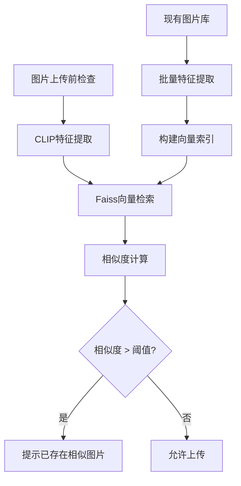
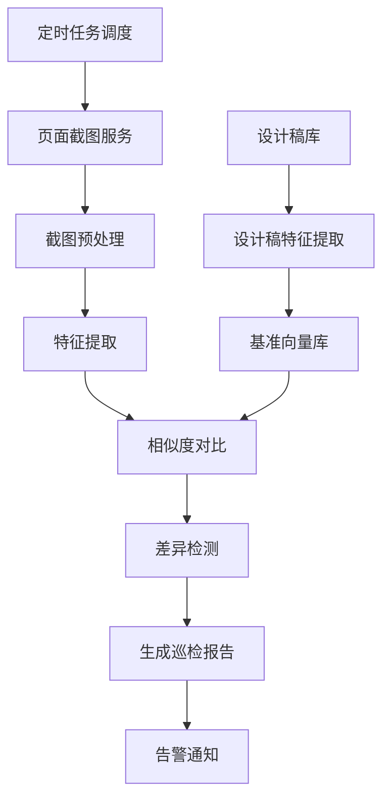

# 前端智能提效：用AI解决图片重复上传问题

## 起因：被图片重复问题折磨的日子

说起这个项目的起因，还得从我们团队遇到的一个头疼问题说起。

我们的项目越做越大，参与的人也越来越多。刚开始还好，大家都比较熟悉，知道哪些图片已经用过了。但是随着团队扩张，新人不断加入，问题就来了。

经常有这样的情况：小王上传了一个icon，过两天小李又上传了一个几乎一模一样的。更夸张的是，有时候同一张图片会被上传好几次，只是文件名不一样。

我们粗略统计了一下，目前项目拢共有1.4w张图片，其中单单一个左箭头的icon就重复了30多张。

### 我们试过的那些"土办法"

一开始我们想了各种办法来解决这个问题：

**方法一：靠文件名**  
让大家上传图片的时候起个有意义的名字，比如`login-button-icon.png`。但是你懂的，每个人的命名习惯不一样，`loginBtn.png`、`login_icon.png`、`登录按钮.png`...结果还是一团糟。

**方法二：人工检查**  
安排专人定期检查重复图片。但是上万张图片，靠眼睛看？累死人不说，效果也不好。而且压缩过的图片、改过尺寸的图片，人眼很难判断是不是同一张。

**方法三：MD5对比**  
写了个脚本计算所有图片的MD5值，找出完全相同的文件。这个方法能找出一些重复，但是局限性很大。同一张图片如果被压缩了、改了格式、调了尺寸，MD5就完全不一样了。

试了一圈下来，发现这些方法都不够智能。我们需要的是能够"看懂"图片内容的工具，而不是简单的文件对比。

## 解决方案：让AI来帮我们"看图"

既然人工不行，文件对比也不行，那就让AI来帮忙吧。我们的想法很简单：能不能让机器像人一样"看懂"图片的内容，然后告诉我们哪些图片是相似的？

经过一番调研，我们决定用CLIP模型来做图片特征提取，用Faiss来做相似度检索。

### 为什么选择CLIP和Faiss？

**关于CLIP的选择**

CLIP是OpenAI开源的一个模型，最大的特点是能够同时理解图片和文字。对我们来说，最重要的是它能把图片转换成一个512维的向量，这个向量包含了图片的"语义信息"。

简单来说，如果两张图片看起来很像，那么它们的向量也会很相似。而且CLIP很聪明，即使图片被压缩了、改了尺寸、换了格式，只要内容相似，向量就会相似。

我们试过几个不同的模型，最后选择了`Xenova/clip-vit-base-patch16`，主要是因为：
- 可以在Node.js服务器上运行，部署简单
- 准确率够用，基本能识别出我们需要的相似图片
- 速度还可以，处理一张图片大概200毫秒

**关于Faiss的选择**

有了图片的向量表示，下一步就是怎么快速找到相似的向量。如果只有几十张图片，暴力对比也行。但我们有3000多张图片，而且还在不断增加，就需要一个专门的向量数据库了。

Faiss是Facebook开源的向量检索库，专门用来解决这种问题。它的优点是：
- 速度快：几毫秒就能从百万个向量中找到最相似的
- 内存省：用了很多优化技巧，不会把内存撑爆
- 好扩展：以后图片更多了，也能应付

### 整体架构



## 具体怎么实现的

### 核心思路

整个系统的工作流程其实挺简单的：

1. 把所有图片都用CLIP模型转换成向量
2. 把这些向量存到Faiss数据库里
3. 当有新图片要上传时，也转换成向量
4. 在数据库里搜索相似的向量
5. 如果找到了，就提示用户"已经有类似的图片了"

### 代码实现的关键部分

#### 图片特征提取的适配器

```javascript
class TransformerEmbeddings extends Embeddings {
  constructor(extractor) {
    super();
    this.extractor = extractor;
  }

  async embedQuery(imageSource) {
    let imageBuffer;
    
    // 支持多种图片源
    if (imageSource.startsWith('http')) {
      // 处理网络图片（图床URL）
      const response = await fetch(imageSource);
      const arrayBuffer = await response.arrayBuffer();
      imageBuffer = Buffer.from(arrayBuffer);
    } else {
      // 处理本地图片
      imageBuffer = await fs.readFile(imageSource);
    }

    // 图片预处理：确保格式一致性
    const processedBuffer = await sharp(imageBuffer)
      .flatten({ background: { r: 255, g: 255, b: 255 } })
      .toFormat('jpeg')
      .toBuffer();

    // 转换为模型输入格式
    const rawImage = await RawImage.fromBlob(new Blob([processedBuffer]));
    
    // 特征提取
    const result = await this.extractor(rawImage, {
      pooling: 'mean',
      normalize: true,
    });

    return Array.from(result.data);
  }
}
```

这个类的作用是把CLIP模型包装一下，让它能和LangChain的Faiss组件配合使用。

几个要注意的地方：
- **支持多种图片来源**：既能处理本地文件，也能处理网络上的图片URL
- **图片预处理**：用Sharp库把图片统一转换成JPEG格式，避免格式不一致的问题

#### 重复图片检测器

```javascript
class ImageDuplicateFinder {
  constructor() {
    this.vectorStore = null;
  }

  // 批量检测重复图片
  async findDuplicates(imagePaths, threshold = 0.95) {
    const duplicateGroups = [];
    
    for (let i = 0; i < imagePaths.length; i++) {
      const queryPath = imagePaths[i];
      const similarImages = await this.findSimilarImages(
        queryPath, 
        threshold, 
        10
      );
      
      if (similarImages.length > 0) {
        duplicateGroups.push({
          original: queryPath,
          duplicates: similarImages,
          potentialSavings: this.calculateSavings(similarImages)
        });
      }
    }
    
    return duplicateGroups;
  }
}
```

### 实际使用效果

#### 上传前的智能提醒

```javascript
// 集成到上传流程中
async function checkBeforeUpload(imageFile) {
  const finder = new ImageDuplicateFinder();
  await finder.loadDatabase('faiss_index');
  
  // 检查是否存在相似图片
  const similarImages = await finder.findSimilarImages(
    imageFile.path, 
    0.90  // 90%相似度阈值
  );
  
  if (similarImages.length > 0) {
    return {
      shouldUpload: false,
      message: `发现${similarImages.length}张相似图片`,
      alternatives: similarImages.map(img => ({
        url: img.metadata.url,
        similarity: img.similarity,
        size: img.metadata.size
      }))
    };
  }
  
  return { shouldUpload: true };
}
```

现在当开发者要上传图片时，系统会自动检查是否已经有类似的图片了。如果有，就会提示："嘿，已经有3张相似的图片了，要不要用现有的？"

#### 批量清理重复图片

```javascript
// 定期清理重复图片
async function cleanupDuplicates() {
  const finder = new ImageDuplicateFinder();
  const allImages = await getAllProjectImages();
  
  const duplicateReport = await finder.findDuplicates(allImages);
  
  // 生成清理建议
  const cleanupSuggestions = duplicateReport.map(group => ({
    keepImage: group.original,
    removeImages: group.duplicates,
    spaceSaved: group.potentialSavings.space,
    costSaved: group.potentialSavings.cost
  }));
  
  // 输出清理报告
  console.log(`发现${duplicateReport.length}组重复图片`);
  console.log(`预计节省空间：${totalSpaceSaved}MB`);
  console.log(`预计节省成本：$${totalCostSaved}/月`);
  
  return cleanupSuggestions;
}
```

我们还写了个脚本，定期扫描所有图片，生成重复图片的清理建议。

### 遇到的一些坑和优化

#### 相似度阈值很难调

不同类型的图片，相似度阈值应该不一样。比如icon要求很严格，0.95以上才算相似；但是照片就可以宽松一点，0.85就行了。

我们最后做了个自适应的策略：

```javascript
const thresholds = {
  'icon': 0.95,        // 图标要求严格
  'photo': 0.85,       // 照片可以宽松点
  'background': 0.80   // 背景图更宽松
};
```

## 下一步计划：自动化UI巡检

有了图片相似度检索的基础，我们想到了一个更有意思的应用场景：**自动检查线上页面是否和设计稿一致**。

你知道的，设计师给了设计稿，开发按照设计稿写代码，但最终上线的页面和设计稿总是会有些差异。有时候是开发理解有偏差，有时候是浏览器兼容性问题，有时候是数据问题导致的布局异常。

以前这种问题只能靠人工巡检，或者等用户反馈。现在我们想用技术手段来自动化这个过程。

### 基本思路



### 具体怎么实现

#### 定时截图功能

```javascript
class PageScreenshotService {
  constructor() {
    this.browser = null;
  }

  async initBrowser() {
    this.browser = await puppeteer.launch({
      headless: true,
      args: ['--no-sandbox', '--disable-setuid-sandbox']
    });
  }

  async capturePageScreenshot(url, options = {}) {
    const page = await this.browser.newPage();
    
    try {
      // 设置视口大小
      await page.setViewport({
        width: options.width || 1920,
        height: options.height || 1080
      });

      // 访问页面
      await page.goto(url, { 
        waitUntil: 'networkidle2',
        timeout: 30000 
      });

      // 等待页面完全加载
      await page.waitForTimeout(2000);

      // 截图
      const screenshot = await page.screenshot({
        fullPage: options.fullPage || false,
        type: 'png'
      });

      return screenshot;
    } finally {
      await page.close();
    }
  }
}
```

用Puppeteer定时访问线上页面，截图保存下来。

#### 智能对比分析

```javascript
class UIComparisonEngine {
  constructor() {
    this.finder = new ImageDuplicateFinder();
    this.thresholds = {
      identical: 0.98,      // 几乎相同
      similar: 0.90,        // 相似
      different: 0.70       // 有差异但可接受
    };
  }

  async compareWithDesign(screenshotBuffer, designImagePath) {
    // 1. 提取截图特征
    const screenshotFeatures = await this.finder.extractImageFeatures(
      screenshotBuffer
    );

    // 2. 提取设计稿特征
    const designFeatures = await this.finder.extractImageFeatures(
      designImagePath
    );

    // 3. 计算相似度
    const similarity = this.calculateSimilarity(
      screenshotFeatures, 
      designFeatures
    );

    return {
      similarity,
      status: this.getComparisonStatus(similarity)
    };
  }

  getComparisonStatus(similarity) {
    if (similarity >= this.thresholds.identical) {
      return 'IDENTICAL';
    } else if (similarity >= this.thresholds.similar) {
      return 'SIMILAR';
    } else if (similarity >= this.thresholds.different) {
      return 'MINOR_DIFFERENCES';
    } else {
      return 'MAJOR_DIFFERENCES';
    }
  }
}
```

把截图和设计稿都转换成向量，然后计算相似度。

#### 自动生成巡检报告

```javascript
class InspectionReportGenerator {
  async generateReport(inspectionResults) {
    const report = {
      timestamp: new Date(),
      summary: this.generateSummary(inspectionResults),
      details: inspectionResults.map(result => ({
        page: result.url,
        status: result.comparisonResult.status,
        similarity: result.comparisonResult.similarity,
        issues: this.extractIssues(result)
      }))
    };

    // 生成HTML报告
    const htmlReport = await this.renderHTMLReport(report);
    
    // 如果发现问题，发送告警
    if (report.summary.pagesWithIssues > 0) {
      await this.sendSlackNotification({
        channel: '#ui-alerts',
        message: `🚨 UI巡检发现${report.summary.pagesWithIssues}个页面存在问题`
      });
    }

    return report;
  }
}
```

把检测结果整理成报告，如果发现问题就发送告警。

### 定时任务调度

```javascript
class InspectionScheduler {
  start() {
    // 每日凌晨2点执行全量巡检
    cron.schedule('0 2 * * *', async () => {
      console.log('开始执行每日UI巡检...');
      await this.runFullInspection();
    });

    // 每小时执行关键页面巡检
    cron.schedule('0 * * * *', async () => {
      console.log('开始执行关键页面巡检...');
      await this.runCriticalPagesInspection();
    });
  }
}
```

用cron定时执行巡检任务。

### 为啥会想做这个呢

这就像后台有接口监控一样，前端页面巡检其实更加重要。因为前端页面的异常来源很复杂：

- **接口层面**：API异常、数据格式变化、超时等导致页面显示错误
- **前端逻辑**：JavaScript报错、状态管理问题、组件渲染异常
- **权限控制**：用户权限变化导致页面功能缺失或显示异常
- **UI层面**：CSS样式问题、响应式布局异常、浏览器兼容性
- **极端情况**：直接白屏、页面崩溃

而且前端问题往往是用户最直接感受到的，一个小的显示异常可能就会影响用户体验，甚至导致业务损失。所以自动化的前端页面巡检确实很有必要，否则只有接到用户真实投诉，才知道页面的问题，总会慢人一步，所以前端巡检也是我们接下来团队要做的事情。


## 开发过程中踩过的坑

### 模型加载时间长的问题

CLIP模型第一次加载要30秒左右。我们做了个模型预热机制：

```javascript
// 服务启动时就加载模型
class ModelManager {
  static instance = null;
  
  static async getInstance() {
    if (!this.instance) {
      console.log('正在加载CLIP模型...');
      this.instance = await pipeline('image-feature-extraction', 'Xenova/clip-vit-base-patch16');
      console.log('模型加载完成');
    }
    return this.instance;
  }
}
```

## 总结

重复图片减少了，对于cdn的负担也降低了，而且这个项目让我们对AI在实际业务中的应用有了更深的理解：

1. **AI不是万能的**：模型的准确率、处理速度、资源消耗都需要平衡
2. **数据质量很重要**：图片的预处理、格式统一对结果影响很大

### 下一步的计划

**短期（3个月）**
- 把UI巡检功能做出来，解决线上页面和设计稿不一致的问题
- 根据用户反馈继续优化检测精度
- 支持更多的图片格式

**中期（6个月）**
- 支持移动端页面的检测
- 做一个更友好的管理界面
- 提供API给其他系统使用

**长期（1年）**
- 建立公司级的图片资源库，各个项目都能复用
- 基于历史数据给设计师推荐合适的图片
- 从设计到开发到上线的全流程质量监控

### 写在最后

更重要的是，我们意识到**前端工程师不应该只是AI的一个壳**。我们需要培养AI思维，主动思考如何用AI技术解决实际问题。

这个项目就是我们的AI试验田。通过实际动手，我们积累了从问题识别、技术选型到工程落地的完整经验。这些经验比单纯学习AI理论更有价值，因为它们来自真实的业务场景。

随着AI技术的快速发展，前端工程师如果只停留在传统的页面开发上，很可能会被时代抛弃。我们需要提前布局，在日常工作中主动寻找AI的应用场景，把AI当作解决问题的工具，而不是高不可攀的技术。

只有这样，当下一个技术浪潮来临时，我们才能从容应对，而不是被动跟随。